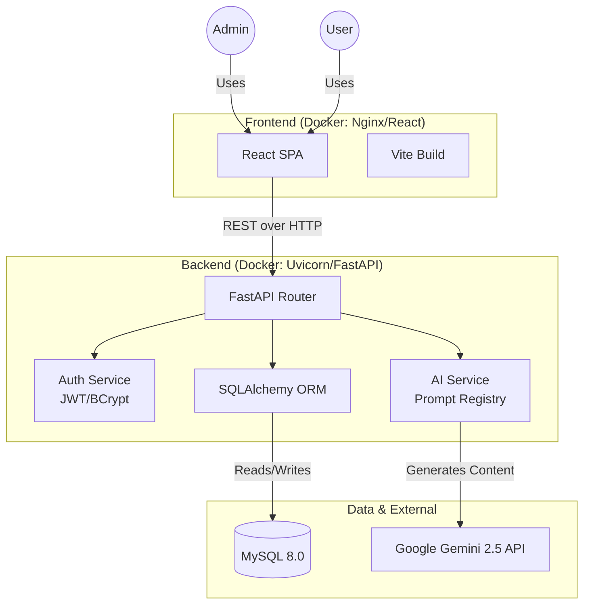
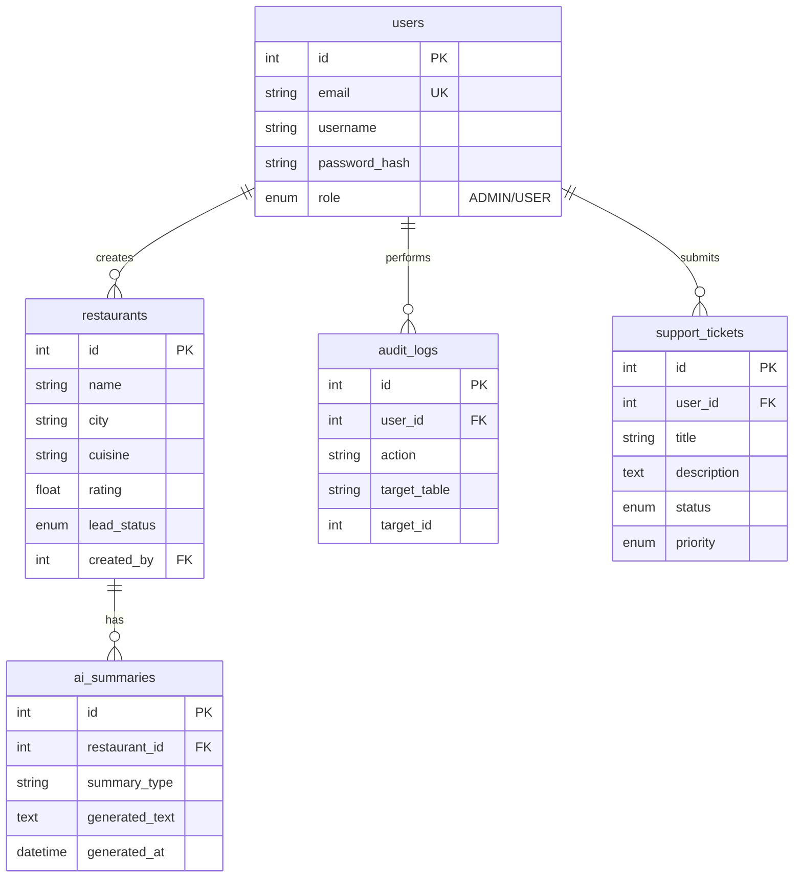

# RestaurantIQ: AI-Powered Discovery Platform

A full-stack, AI-powered restaurant discovery and lead management platform.

## 🚀 Features
- **Secure Authentication & Approval Workflow**: JWT-based login with BCrypt password hashing. New user registrations require approval via the Admin Dashboard before granting access.
- **Support Ticket Helpdesk**: Full built-in support portal. Users can submit and track tickets; Admins can view and manage ticket statuses via a unified interface.
- **Restaurant Management**: Full CRUD capabilities for restaurant data with distinct fields and lead status tracking.
- **Advanced Search**: Filter restaurants by name, city, minimum rating, and lead status, with built-in pagination.
- **AI Integrations with Guardrails**: Powered by **Google Gemini 2.5 Flash**. Generates summaries, customer sentiment, marketing copy, and outreach emails. Includes a custom user prompt feature protected by strict guardrails (keyword blocklists, length validation, and system prompt restrictions).
- **Audit Logging**: All write operations (Create, Update, Delete) are tracked to the user who performed them.
- **Rate Limiting**: Integrated SlowAPI to protect the AI generation endpoints from spam (5 req/min).
- **API Testing**: Included a `bruno_collection` folder so API tests are saved directly in the code repository instead of using Postman.
- **Custom UI Design**: Built the frontend from scratch using React, focusing on a clean, modern look with semi-transparent backgrounds and smooth popup notifications.

---

## 🏗️ Architecture



---

## 🗄️ Database Schema

The database is fully normalized with primary keys, foreign keys, and indexes on commonly searched fields. Migration scripts are provided via **Alembic**.



---

## ⚙️ Setup & Deployment (Docker)

This application is fully containerized and runs entirely through Docker Compose.

### 1. Prerequisites
- Docker & Docker Compose installed.
- A Google Gemini API Key.

### 2. Configuration
Create a `.env` file in the `./backend` directory:
```env
DATABASE_URL=mysql+pymysql://user:password@db:3306/restaurant_platform
SECRET_KEY=your_secure_secret_key_here
ALGORITHM=HS256
ACCESS_TOKEN_EXPIRE_MINUTES=60
GEMINI_API_KEY=your_gemini_key_here
```

### 3. Run the Application
From the root directory of the project, run:
```bash
docker-compose up --build
```
This single command will:
1. Start the MySQL database container.
2. Build and start the FastAPI backend container.
3. Automatically seed the database with 25 real-world restaurants via `seed.py`.
4. Build the React application and serve it via an Nginx container.

### 4. Access the App
- **Frontend UI:** `http://localhost`
- **Backend Swagger API Docs:** `http://localhost:8000/docs`

**Demo Login:**
- Email: `admin@restaurant.com`
- Password: `Admin1234`

---

## 🌟 Bonus Features Achieved
We went above and beyond the core requirements by implementing:
- **Role-based authorization:** Standard users can only view records; Admins have full CRUD access.
- **Audit logging:** Tracks every create, update, and delete action in a dedicated MySQL `audit_logs` table.
- **Rate limiting:** API endpoints are protected with `slowapi` to prevent abuse.
- **Sample data:** Provided both a Python seed script (`seed.py`) and a raw database dump (`sample_data.sql`).

---

## 📝 Assumptions Made
1. **AI Provider:** Assumed Google Gemini 2.5 Flash as the optimal LLM provider due to speed, context window size, and cost-efficiency.
2. **Docker Orchestration:** Assumed a single `docker-compose.yml` is preferred for easy local testing over complex Kubernetes manifests.
3. **Database:** Assumed MySQL 8.0 over PostgreSQL based on common enterprise familiarity, though SQLAlchemy makes this easily swappable.
4. **Caching Strategy:** Assumed caching AI generation results in the MySQL `ai_summaries` table is sufficient for this scale, rather than introducing a separate Redis cluster which would increase deployment complexity.
